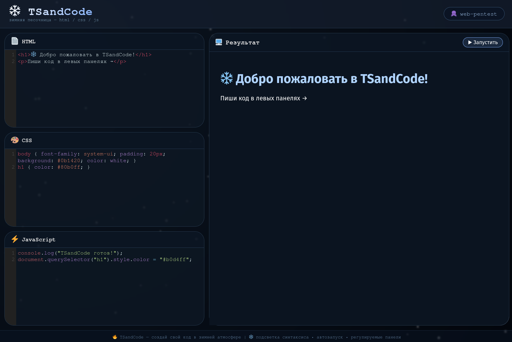

# ❄️ TSandCode — зимняя песочница кода

**Живой редактор HTML/CSS/JS с подсветкой синтаксиса, снежинками и мгновенным выводом.**

[](https://web-pentest.github.io/TSandCode/)
[](LICENSE)
[](https://github.com/web-pentest)
[]()

<p align="center">
  
</p>

---

## ✨ Возможности

- 📝 **Три панели**: HTML, CSS, JavaScript — каждый язык в своём окне с подсветкой синтаксиса
- 👁️ **Живой вывод**: результат обновляется автоматически при вводе (или по кнопке)
- 🖥️ **Большое окно вывода**: правая панель шире левой — удобно смотреть результат
- 🎨 **Подсветка синтаксиса**: как в VS Code (CodeMirror)
- 💾 **Автосохранение**: код сохраняется в браузере — при перезагрузке всё остаётся
- ❄️ **Зимний вайб**: снежинки, стеклянные панели, голубые акценты
- 📱 **Адаптивность**: работает на телефонах и планшетах

---

## 🚀 Быстрый старт

1. Перейди на [демо-страницу](https://web-pentest.github.io/TSandCode/)
2. Пиши код в левых панелях (HTML/CSS/JS)
3. Результат появляется справа мгновенно
4. Закрой страницу — код сохранится

---

## 🛠️ Технологии

- HTML5
- CSS3 (Flexbox, анимации, backdrop-filter)
- JavaScript (ES6)
- CodeMirror (подсветка синтаксиса)

---

## 📁 Локальный запуск

```bash
git clone https://github.com/web-pentest/TSandCode.git
cd TSandCode
```
# открой index.html в браузере

## 🧑‍💻 Автор

**web-pentest** — [GitHub](https://github.com/web-pentest)  
🐙 Другие проекты: [DarkVPN](https://github.com/web-pentest/DarkVPN), [Arch-Neofetch](https://web-pentest.github.io/Arch-Neofetch/) и другие.

## ❄️ Зимняя атмосфера

Проект создан в холодном минималистичном стиле: снежинки, стеклянные панели, неоновые акценты. Идеально для вечернего кодинга под горячий чай ☕

---

## 📜 Лицензия

MIT — свободно используй и модифицируй. Ссылка на автора приветствуется.
